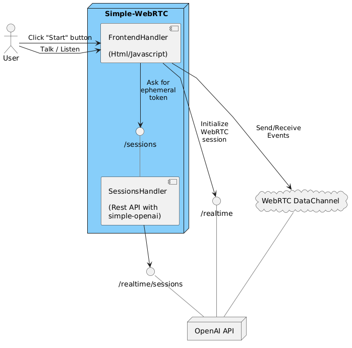
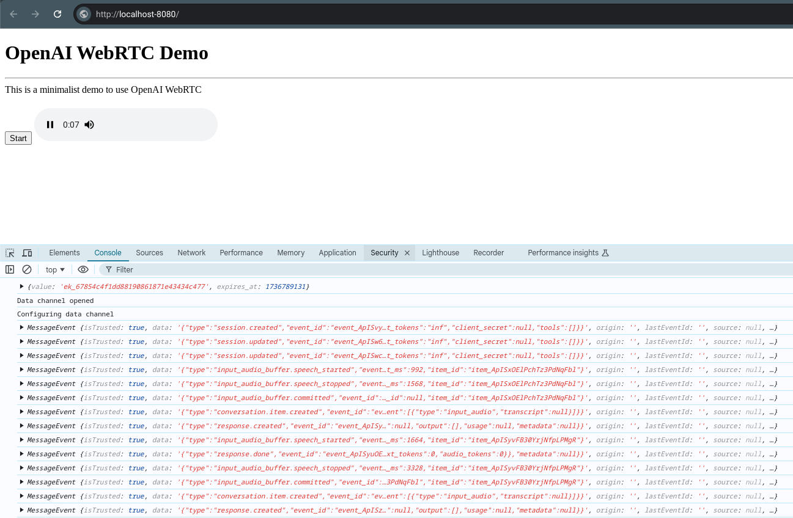

# OpenAI WebRTC Java Demo

This is a minimalist application to demonstrate how to use the [OpenAI WebRTC](https://platform.openai.com/docs/guides/realtime-webrtc) with Java. The Java application exposes two components: the frontend and the backend. The backend component is supported by [simple-openai](https://github.com/sashirestela/simple-openai). The frontend component is made of Html and vanilla Javascript.



## Running the Application

### Prerequisites

- **Java** (version 11 or later)

### Procedure

1. **Clone this repository:**
   ```bash
   git clone https://github.com/sashirestela/simple-webrtc.git
   cd simple-webrtc
   ```
1. **Create an environment variable for your OpenAI Api Key:**
   ```bash
   export OPENAI_API_KEY=<here goes your api key>
   ```

1. **Build the project:**
   ```bash
   ./mvnw clean install
   ```

1. **Run the application:**
   ```bash
   ./mvnw exec:java -Dexec.mainClass=com.sashirestela.webrtc.Application
   ```

## Using the Application

1. Open your browser and navigate to http://localhost:8080

1. Prepare your multimedia devices (microphone and speakers).

1. Click the "Start" button to begin a WebRTC session.

1. Talk to the AI when you see the media control.

1. In the console you will see all the Realtime events.

1. Click the "Stop" button to finish the previously started WebRTC session.

